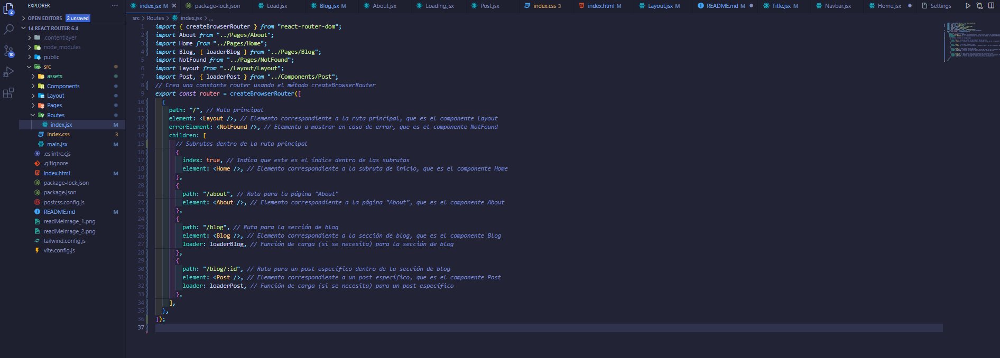
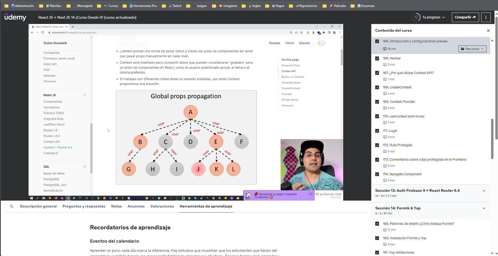

# Template para desarrollar con Vite, React, React Router y tailwind.

### Objetivo del templarte:

La presente página web está enfocada al uso personal, y me resultaba imprescindible contar con una estructura para la creación de un sitio web previamente configurada y listo para el desarrollo. Es responsive y considero que será de gran utilidad, pudiendo incorporarle mejoras. Me importaría actualizarla a medida que vaya adquiriendo habilidades tanto como gestiones nuevas y las tecnologías vayan evolucionando. Tal vez también a otra persona le resulta cómodo para ejemplificaciones o como un punto de partida para comenzar a crear. Si fuera así, dejaré algunos datos para configurar o desconfigurar lo escrito en el código según lo requiera.

## Estructura

El sitio web cuenta con tres sesiones:

- **INICIO** => src\Pages\Home.jsx
- **TECNOLOGÍAS** => src\Pages\About.jsx
- **BLOG** => src\Pages\Blog.jsx

[Aquí puedes revisar el Template router ](https://templaterouter.netlify.app/)

Para el caso particular, el Home contiene una presentación de las tecnologías del proyecto, seguido del About, que contiene una breve descripción de estas tecnologías y las versiones utilizadas, finalizando con la sección Blog en el cual llamamos a un API para que nos devuelva contenido y poder filtrar los resultados a través de una barra de búsqueda.

También puedes encontrar componentes para errores de petición, de espera para carga de contenido y para revisar un post en particular.

Tanto las páginas y componentes se montarán en el layout. En cuanto a las rutas, está todo configurado. Aunque más adelante vamos a configurar rutas protegidas en un repositorio nuevo.

## Configuraciones Simple

En src\Routes\index.jsx vamos a encontrar la configuración de nuestras rutas, que lógicamente serán manipuladas de acuerdo a tus necesidades, pero mínimamente cargué una principal, con sus subdirecciones, con los elementos correspondientes a mostrar, entre ellas, las funciones de error y carga.

En src\Layout\Layout.jsx podrás ver que allí asignamos etiquetas para cambiar de color según la dimensión con la que estemos trabajando. Es útil para establecer como se deben comportar cada uno de nuestro componente de manera responsiva a medida que va variando la resolución de la pantalla o del dispositivo donde se esté visitando la web. Claramente, si te parece innecesario, puedes presidir de esas etiquetas.

## Million

Hemos incorporado Million, guiándome por la explicación de su página oficial Millions.js es un compilador de optimización extremadamente rápido y liviano que hace que los componentes sean hasta un 70% más rápidos.

En resumen: Imagina componentes de React ejecutándose a la velocidad de JavaScript puro.

[Million js site](<(https://million.dev/es-ES)>)

## Bluuweb

Esta plantilla es parte de un ejercicio de un curso muy completo del creador de contenido Bluuweb. El curso se titula Aprende React JS y Next 14 (app router) este 2024, Creando SPA, SSG, SSR con Login, React Hooks, Context API &amp; Firebase. Las clases son muy prácticas, lo que hace que el aprendizaje sea más fácil de asentar. Por supuesto que esta en uno y su capacidad para comprometerse a realizar código, probar y experimentar.

#### Información:

- [Manual de Bluuweb](https://bluuweb.dev/05-react/06-context-auth.html "Manual de Bluuweb")
- [Curso de React JS y Next 14 (app router) este 2024](https://www.udemy.com/course/curso-react-js/learn/lecture/35323510#learning-tools "Curso de  React JS y Next 14 (app router) este 2024")

|  | Mis primeras páginas webs tendrán estas estructuras y a medida que las versiones se vayan actualizando, procederé a hacer los cambios necesarios. Por el momento estoy muy feliz con lo aprendido, aunque si bien este curso lo hice hace varios meses, hacer un repaso nunca está de más. Te comparto los links de los recursos que me permitieron seguir paso a paso los ejercicios: |
| :-------------------------------------------------------------------------------------------------------: | :------------------------------------------------------------------------------------------------------------------------------------------------------------------------------------------------------------------------------------------------------------------------------------------------------------------------------------------------------------------------------------- |

## Por último

Te agradezco que te tomarás el tiempo de leer. Te dejo mis redes, ya que por las tardes estoy estudiando programación en vivo bajo el formato "Study With Me" por si quieres sumarte o consultarme algo en específico.

- [Twitter](https://twitter.com/AgustnOntivero6 "Twitter")
- [Instagram](http://https://www.instagram.com/luciano.a.ontiveros/ "Instagram")
- [Twitch ](https://twitch.tv/cuartodechenz "Twitch ")
- [Threads](https://www.threads.net/@luciano.a.ontiveros?hl=es-la "Threads")
- [Discord](https://discord.gg/UdU3wvpWu7 "Discord")
